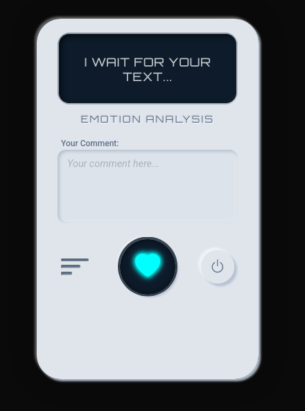
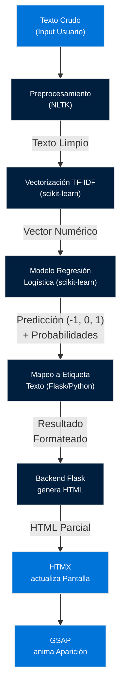

# Sentiment Analyzer Machine




## Licencia

Este proyecto (todo el código: Python, HTML, CSS, JavaScript) está bajo la **Licencia MIT**. Puedes encontrar el texto completo de la licencia en el archivo [LICENSE](LICENSE) en la raíz del repositorio.

**Importante:** La **Licencia MIT aplica únicamente al CÓDIGO**. El **dataset** utilizado (`Reddit_Data.csv`) y el **modelo entrenado** derivado de él (`model/` archivos) están bajo la licencia **Creative Commons Attribution-NonCommercial-ShareAlike 4.0 (CC BY-NC-SA 4.0)**. Esto significa que:
*   Debes acreditar al autor original del dataset (cosmos98, como se detalla en la sección de Instalación).
*   No puedes usar el dataset original ni el modelo entrenado (los archivos .pkl producidos por este código con ese dataset) con fines **comerciales**.
*   Si adaptas el dataset o el modelo entrenado y los distribuyes, debes hacerlo bajo la misma licencia CC BY-NC-SA 4.0.

Si planeas usar este código con un propósito comercial, deberás utilizar un dataset diferente cuya licencia lo permita y re-entrenar el modelo con ese nuevo dataset.

## Descripción del Proyecto

Esta es una aplicación web interactiva que simula una "Máquina de Análisis de Sentimiento". El backend, desarrollado con Python y Flask, implementa un **pipeline básico de Procesamiento de Lenguaje Natural (PLN) y Machine Learning** para **clasificación de texto**. El usuario ingresa texto a través de una interfaz web (construida con HTML/CSS moderno), y una petición asíncrona (manejada por HTMX) envía el texto al backend. El sistema predice el sentimiento predominante del texto (Positivo, Negativo o Neutral) utilizando un **modelo de clasificación supervisada (Regresión Logística)**. El resultado y un indicador de confianza son mostrados dinámicamente en la "pantalla digital" de la interfaz con animaciones (GSAP).

Este proyecto sirve como una demostración práctica de la integración de modelos predictivos en aplicaciones web funcionales, mostrando cómo un resultado de ML puede ser presentado de forma interactiva en el frontend.

## Características Clave

*   **Clasificación de Sentimiento:** Predice el sentimiento de un texto (`Positivo`, `Negativo`, `Neutral`) utilizando un modelo de **Regresión Logística (Logistic Regression)**.
*   **Pipeline de PLN:** Incluye etapas de preprocesamiento de texto (tokenización, eliminación de stopwords, stemming/lematización).
*   **Vectorización TF-IDF:** Transforma el texto preprocesado en características numéricas utilizando la técnica **TF-IDF (Term Frequency-Inverse Document Frequency)**.
*   Interfaz de usuario distintiva y animada, inspirada en una máquina digital.
*   Comunicación asíncrona frontend-backend con **HTMX**.
*   Animaciones fluidas en la interfaz (`GSAP`).
*   Visualización dinámica del resultado y confianza en pantalla simulada.
*   Serialización y carga eficiente del modelo y vectorizador (`joblib`).

## Tecnologías Utilizadas

**Backend (Python):**

*   **Flask:** Microframework web.
*   **scikit-learn:** Implementación del modelo de **Regresión Logística** y el **TfidfVectorizer**.
*   **pandas:** Carga y manipulación del dataset.
*   **nltk:** Herramientas para **Procesamiento de Lenguaje Natural (PLN)**.
*   **joblib:** Serialización de objetos Python.

**Frontend (Web):**

*   **HTML5, CSS3:** Estructura y estilizado (layout con Flexbox/Grid, diseño neumórfico/biselado).
*   **HTMX:** Interacción asíncrona sin JavaScript complejo.
*   **GSAP:** Animaciones web.
*   **Bootstrap (parcial):** Íconos (`Bootstrap Icons`), utilidades de layout.


## Cómo Funciona (Diagrama Simplificado del Pipeline)




## Habilidades Demostradas

Al construir este proyecto, he aplicado y reforzado activamente habilidades clave en:

    Machine Learning Aplicado: Implementación de un pipeline de clasificación de texto supervisada.

    Modelos Predictivos: Uso específico de la Regresión Logística para una tarea de clasificación categórica (-1, 0, 1).

    Procesamiento de Lenguaje Natural (PLN): Aplicación de técnicas estándar como tokenización, manejo de stopwords y stemming/lematización con nltk.

    Ingeniería de Características Textuales: Dominio de la técnica de vectorización TF-IDF (TfidfVectorizer) para representar datos textuales de forma cuantitativa.

    Desarrollo Full-Stack: Conexión y comunicación fluida entre un backend Python/Flask y un frontend web dinámico.

    Integración Web Asíncrona: Uso estratégico de HTMX para crear una experiencia de usuario responsiva sin la complejidad de un framework JS tradicional.

    Serialización y Persistencia de Modelos ML: Gestión del ciclo de vida del modelo y vectorizador mediante joblib.

    Diseño de Interfaz (UI) Avanzado con CSS: Creación de layouts complejos (Flexbox/Grid) y aplicación de efectos visuales detallados como el diseño neumórfico/biselado utilizando box-shadow.

    Animación Web Performante: Integración de GSAP para efectos visuales suaves.

    Manejo de Datos: Carga, limpieza y transformación de datos tabulares (pandas).

    Depuración Sistemática y Resolución de Problemas: Identificación y solución de errores en múltiples capas del stack (backend, frontend, pipeline de datos ML, serialización), incluyendo NameError, ValueError relacionados con tipos de datos en ML, y manejo de peticiones web. Cada error fue una oportunidad para profundizar en la comprensión del funcionamiento interno y la interoperabilidad de las herramientas.

## Instalación y Ejecución Local

Sigue estos pasos para poner la aplicación en marcha en tu máquina local:

1. Clonar el Repositorio:

          
    git clone ... https://github.com/Roska-x/Sentymental-Analysis-Machine/ ...
    cd sentiment_analyzer

        


2. Crear y Activar Entorno Virtual: (Altamente recomendado para aislar las dependencias)

      
python3 -m venv venv
source venv/bin/activate


3. Instalar Dependencias de Python:

      
pip install -r requirements.txt

    


4. Descargar Datos de NLTK: Necesario para el preprocesamiento de texto.

      
python -c "import nltk; nltk.download('punkt'); nltk.download('stopwords'); nltk.download('wordnet'); nltk.download('omw-1.4')"
    


(Si el descargador de NLTK interactivo se abre en tu terminal, confirma las descargas).

5. Obtener el Dataset de Entrenamiento:
El dataset utilizado es "Sentiment Analysis on Multi-Source Social Media Text" de cosmos98 en Kaggle. Contiene datos de Reddit y Twitter. Para este proyecto, se utiliza específicamente el archivo Reddit_Data.csv.
Enlace al Dataset Original: https://www.kaggle.com/datasets/cosmos98/sentiment-analysis-on-multi-source-social-media

Licencia: Este dataset está bajo la licencia Creative Commons Attribution-NonCommercial-ShareAlike 4.0 (CC BY-NC-SA 4.0). Se agradece y respeta la labor del autor original. Más detalles: https://creativecommons.org/licenses/by-nc-sa/4.0/

Nota sobre Modificaciones: El archivo Reddit_Data.csv descargado directamente de Kaggle no fue modificado. Las operaciones de limpieza de etiquetas (para convertir '1', '0', '-1' a valores numéricos enteros y eliminar filas con etiquetas no numéricas como 'category') y el preprocesamiento de texto se realizan dinámicamente durante la ejecución del script de entrenamiento (train_model.py) utilizando pandas y NLTK.

Acción: Descarga el archivo Reddit_Data.csv desde el enlace de Kaggle y colócalo en el directorio raíz de este proyecto (sentiment_analyzer/).


6. Entrenar y Guardar el Modelo:
Ejecuta el script de entrenamiento una sola vez. Esto procesará el dataset y generará los archivos vectorizer.pkl y sentiment_model.pkl en la carpeta model/. Asegúrate de haber ajustado la configuración de idioma (stop_words_lang) y la regex en train_model.py (¡y en app.py!) si tu dataset usa español o tiene un formato de texto particular.

      
python train_model.py

    

(Este script puede tardar unos minutos dependiendo de tu dataset y CPU. Debería imprimir mensajes de DEBUG sobre el proceso y la evaluación.)

7. Ejecutar la Aplicación Flask:

      
python app.py


(Verás mensajes DEBUG de Flask en tu terminal.)

8. Acceder a la Aplicación: Abre tu navegador web y visita http://127.0.0.1:5000/.

## Estructura del Proyecto

```text
sentiment_analyzer/
├── app.py                 # Aplicación Flask principal
├── train_model.py         # Script para entrenar y guardar el modelo ML
├── requirements.txt       # Dependencias de Python
├── Reddit_Data.csv        # Archivo del dataset de entrenamiento
├── model/                 # Carpeta para guardar archivos del modelo
│   ├── vectorizer.pkl
│   └── sentiment_model.pkl
├── static/                # Archivos estáticos (CSS, JS, fuentes, imágenes)
│   ├── css/
│   │   └── style.css      # Estilos de la UI y tema original
│   ├── fonts/             # (Ej: Orbitron-Regular.ttf si usas fuente digital)
│   │   └── ...
│   ├── img/               # (Ej: favicon.ico, etc.)
│   │   └── ...
│   └── js/
│       └── main.js        # Lógica JavaScript del frontend (GSAP, HTMX)
└── templates/             # Plantillas HTML (Jinja2)
    ├── index.html         # Página principal con la UI
    └── _sentiment_result.html # Fragmento HTML para la respuesta de HTMX
```


## Autor

    Franco Donati

    linkedin.com/in/franco-donati/

    https://github.com/Roska-x/Sentymental-Analysis-Machine/

        
